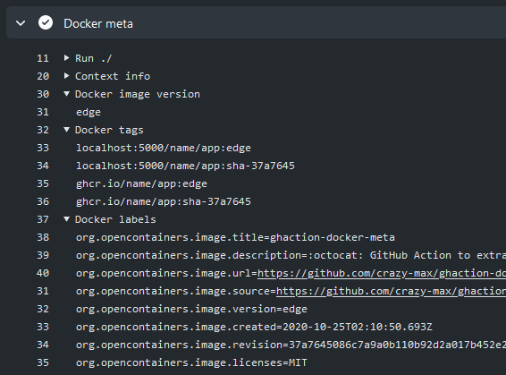

[](https://github.com/docker/metadata-action/releases/latest)
[](https://github.com/marketplace/actions/docker-metadata-action)
[](https://github.com/docker/metadata-action/actions?workflow=ci)
[](https://github.com/docker/metadata-action/actions?workflow=test)
[](https://codecov.io/gh/docker/metadata-action)

## About

GitHub Action to extract metadata from Git reference and GitHub events. This action
is particularly useful if used with [Docker Build Push](https://github.com/docker/build-push-action)
action to tag and label Docker images.



___

* [Usage](#usage)
  * [Basic](#basic)
  * [Semver](#semver)
  * [Bake definition](#bake-definition)
* [Customizing](#customizing)
  * [inputs](#inputs)
  * [outputs](#outputs)
  * [environment variables](#environment-variables)
* [`context` input](#context-input)
* [`images` input](#images-input)
* [`flavor` input](#flavor-input)
* [`tags` input](#tags-input)
  * [`type=schedule`](#typeschedule)
  * [`type=semver`](#typesemver)
  * [`type=pep440`](#typepep440)
  * [`type=match`](#typematch)
  * [`type=edge`](#typeedge)
  * [`type=ref`](#typeref)
  * [`type=raw`](#typeraw)
  * [`type=sha`](#typesha)
* [Notes](#notes)
  * [Image name and tag sanitization](#image-name-and-tag-sanitization)
  * [Latest tag](#latest-tag)
  * [`priority` attribute](#priority-attribute)
  * [Global expressions](#global-expressions)
    * [`{{branch}}`](#branch)
    * [`{{tag}}`](#tag)
    * [`{{sha}}`](#sha)
    * [`{{base_ref}}`](#base_ref)
    * [`{{is_default_branch}}`](#is_default_branch)
    * [`{{date '<format>' tz='<timezone>'}}`](#date-format-tztimezone)
    * [`{{commit_date '<format>' tz='<timezone>'}}`](#commit_date-format-tztimezone)
  * [Major version zero](#major-version-zero)
  * [JSON output object](#json-output-object)
  * [Overwrite labels and annotations](#overwrite-labels-and-annotations)
  * [Annotations](#annotations)
* [Contributing](#contributing)

## Usage

### Basic

```yaml
name: ci

on:
  workflow_dispatch:
  push:
    branches:
      - 'master'
    tags:
      - 'v*'
  pull_request:
    branches:
      - 'master'

jobs:
  docker:
    runs-on: ubuntu-latest
    steps:
      -
        name: Checkout
        uses: actions/checkout@v4
      -
        name: Docker meta
        id: meta
        uses: docker/metadata-action@v5
        with:
          images: name/app
      -
        name: Login to DockerHub
        if: github.event_name != 'pull_request'
        uses: docker/login-action@v3
        with:
          username: ${{ secrets.DOCKERHUB_USERNAME }}
          password: ${{ secrets.DOCKERHUB_TOKEN }}
      -
        name: Build and push
        uses: docker/build-push-action@v6
        with:
          context: .
          push: ${{ github.event_name != 'pull_request' }}
          tags: ${{ steps.meta.outputs.tags }}
          labels: ${{ steps.meta.outputs.labels }}
```

| Event               | Ref                           | Docker Tags                |
|---------------------|-------------------------------|----------------------------|
| `pull_request`      | `refs/pull/2/merge`           | `pr-2`                     |
| `push`              | `refs/heads/master`           | `master`                   |
| `push`              | `refs/heads/releases/v1`      | `releases-v1`              |
| `push tag`          | `refs/tags/v1.2.3`            | `v1.2.3`, `latest`         |
| `push tag`          | `refs/tags/v2.0.8-beta.67`    | `v2.0.8-beta.67`, `latest` |
| `workflow_dispatch` | `refs/heads/master`           | `master`                   |

### Semver

```yaml
name: ci

on:
  push:
    branches:
      - 'master'
    tags:
      - 'v*'
  pull_request:
    branches:
      - 'master'

jobs:
  docker:
    runs-on: ubuntu-latest
    steps:
      -
        name: Checkout
        uses: actions/checkout@v4
      -
        name: Docker meta
        id: meta
        uses: docker/metadata-action@v5
        with:
          images: |
            name/app
          tags: |
            type=ref,event=branch
            type=ref,event=pr
            type=semver,pattern={{version}}
            type=semver,pattern={{major}}.{{minor}}
      -
        name: Login to DockerHub
        if: github.event_name != 'pull_request'
        uses: docker/login-action@v3
        with:
          username: ${{ secrets.DOCKERHUB_USERNAME }}
          password: ${{ secrets.DOCKERHUB_TOKEN }}
      -
        name: Build and push
        uses: docker/build-push-action@v6
        with:
          context: .
          push: ${{ github.event_name != 'pull_request' }}
          tags: ${{ steps.meta.outputs.tags }}
          labels: ${{ steps.meta.outputs.labels }}
```

| Event           | Ref                           | Docker Tags                         |
|-----------------|-------------------------------|-------------------------------------|
| `pull_request`  | `refs/pull/2/merge`           | `pr-2`                              |
| `push`          | `refs/heads/master`           | `master`                            |
| `push`          | `refs/heads/releases/v1`      | `releases-v1`                       |
| `push tag`      | `refs/tags/v1.2.3`            | `1.2.3`, `1.2`, `latest`            |
| `push tag`      | `refs/tags/v2.0.8-beta.67`    | `2.0.8-beta.67`                     |

### Bake definition

This action also handles a bake definition file that can be used with the
[Docker Bake action](https://github.com/docker/bake-action). You just have to
declare an empty target named `docker-metadata-action` and inherit from it.

```hcl
// docker-bake.hcl
target "docker-metadata-action" {}

target "build" {
  inherits = ["docker-metadata-action"]
  context = "./"
  dockerfile = "Dockerfile"
  platforms = [
    "linux/amd64",
    "linux/arm/v6",
    "linux/arm/v7",
    "linux/arm64",
    "linux/386"
  ]
}
```

```yaml
name: ci

on:
  push:
    branches:
      - 'master'
    tags:
      - 'v*'

jobs:
  docker:
    runs-on: ubuntu-latest
    steps:
      -
        name: Docker meta
        id: meta
        uses: docker/metadata-action@v5
        with:
          images: |
            name/app
          tags: |
            type=ref,event=branch
            type=ref,event=pr
            type=semver,pattern={{version}}
            type=semver,pattern={{major}}.{{minor}}
            type=sha
      -
        name: Build
        uses: docker/bake-action@v6
        with:
          files: |
            ./docker-bake.hcl
            cwd://${{ steps.meta.outputs.bake-file }}
          targets: build
```

Content of `${{ steps.meta.outputs.bake-file }}` file, combining tags and
labels, will look like this with `refs/tags/v1.2.3` ref:

```json
{
  "target": {
    "docker-metadata-action": {
      "tags": [
        "name/app:1.2.3",
        "name/app:1.2",
        "name/app:sha-90dd603",
        "name/app:latest"
      ],
      "labels": {
        "org.opencontainers.image.title": "Hello-World",
        "org.opencontainers.image.description": "This your first repo!",
        "org.opencontainers.image.url": "https://github.com/octocat/Hello-World",
        "org.opencontainers.image.source": "https://github.com/octocat/Hello-World",
        "org.opencontainers.image.version": "1.2.3",
        "org.opencontainers.image.created": "2020-01-10T00:30:00.000Z",
        "org.opencontainers.image.revision": "860c1904a1ce19322e91ac35af1ab07466440c37",
        "org.opencontainers.image.licenses": "MIT"
      },
      "args": {
        "DOCKER_META_IMAGES": "name/app",
        "DOCKER_META_VERSION": "1.2.3"
      }
    }
  }
}
```

You can also use the `bake-file-tags` and `bake-file-labels` outputs if you
just want to use tags and/or labels respectively. The following example is
similar to the previous one:

```yaml
      -
        name: Build
        uses: docker/bake-action@v6
        with:
          files: |
            ./docker-bake.hcl
            cwd://${{ steps.meta.outputs.bake-file-tags }}
            cwd://${{ steps.meta.outputs.bake-file-labels }}
          targets: build
```

## Customizing

### inputs

The following inputs can be used as `step.with` keys:

> `List` type is a newline-delimited string
> ```yaml
> labels: |
>   org.opencontainers.image.title=MyCustomTitle
>   org.opencontainers.image.description=Another description
>   org.opencontainers.image.vendor=MyCompany
> ```

| Name              | Type   | Description                                                                  |
|-------------------|--------|------------------------------------------------------------------------------|
| `context`         | String | Where to get context data. Allowed options are: `workflow` (default), `git`. |
| `images`          | List   | List of Docker images to use as base name for tags                           |
| `tags`            | List   | List of [tags](#tags-input) as key-value pair attributes                     |
| `flavor`          | List   | [Flavor](#flavor-input) to apply                                             |
| `labels`          | List   | List of custom labels                                                        |
| `annotations`     | List   | List of custom annotations                                                   |
| `sep-tags`        | String | Separator to use for tags output (default `\n`)                              |
| `sep-labels`      | String | Separator to use for labels output (default `\n`)                            |
| `sep-annotations` | String | Separator to use for annotations output (default `\n`)                       |
| `bake-target`     | String | Bake target name (default `docker-metadata-action`)                          |

### outputs

The following outputs are available:

| Name                    | Type   | Description                                                                                                                                                     |
|-------------------------|--------|-----------------------------------------------------------------------------------------------------------------------------------------------------------------|
| `version`               | String | Docker image version                                                                                                                                            |
| `tags`                  | String | Docker tags                                                                                                                                                     |
| `labels`                | String | Docker labels                                                                                                                                                   |
| `annotations`           | String | [Annotations](https://github.com/moby/buildkit/blob/master/docs/annotations.md)                                                                                 |
| `json`                  | String | JSON output of tags and labels                                                                                                                                  |
| `bake-file-tags`        | File   | [Bake file definition](https://docs.docker.com/build/bake/reference/) path with tags                                                                            |
| `bake-file-labels`      | File   | [Bake file definition](https://docs.docker.com/build/bake/reference/) path with labels                                                                          |
| `bake-file-annotations` | File   | [Bake file definition](https://docs.docker.com/build/bake/reference/) path with [annotations](https://github.com/moby/buildkit/blob/master/docs/annotations.md) |

Alternatively, each output is also exported as an environment variable when `DOCKER_METADATA_SET_OUTPUT_ENV` is `true`:

* `DOCKER_METADATA_OUTPUT_VERSION`
* `DOCKER_METADATA_OUTPUT_TAGS`
* `DOCKER_METADATA_OUTPUT_LABELS`
* `DOCKER_METADATA_OUTPUT_ANNOTATIONS`
* `DOCKER_METADATA_OUTPUT_JSON`
* `DOCKER_METADATA_OUTPUT_BAKE_FILE_TAGS`
* `DOCKER_METADATA_OUTPUT_BAKE_FILE_LABELS`
* `DOCKER_METADATA_OUTPUT_BAKE_FILE_ANNOTATIONS`

So it can be used with our [Docker Build Push action](https://github.com/docker/build-push-action/):

```yaml
- uses: docker/build-push-action@v6
  with:
    build-args: |
      DOCKER_METADATA_OUTPUT_JSON
```

### environment variables

| Name                                 | Type   | Description                                                                                                                                  |
|--------------------------------------|--------|----------------------------------------------------------------------------------------------------------------------------------------------|
| `DOCKER_METADATA_PR_HEAD_SHA`        | Bool   | If `true`, set associated head SHA instead of commit SHA that triggered the workflow on pull request event                                   |
| `DOCKER_METADATA_SHORT_SHA_LENGTH`   | Number | Specifies the length of the [short commit SHA](#typesha) to ensure uniqueness. Default is `7`, but can be increased for larger repositories. |
| `DOCKER_METADATA_ANNOTATIONS_LEVELS` | String | Comma separated list of annotations levels to set for annotations output separated (default `manifest`)                                      |
| `DOCKER_METADATA_SET_OUTPUT_ENV`     | Bool   | If `true`, sets each output as an environment variable (default `true`)                                                                      |

## `context` input

`context` defines where to get context metadata:

```yaml
# default
context: workflow
# or
context: git
```

* `workflow`: Get context metadata from the workflow (GitHub context). See https://docs.github.com/en/actions/learn-github-actions/contexts#github-context
* `git`: Get context metadata from the workflow and overrides some of them with current Git context, such as `ref` and `sha`.

## `images` input

`images` defines a list of Docker images to use as base name for [`tags`](#tags-input):

```yaml
images: |
  name/foo
  ghcr.io/name/bar
  # or
  name=name/foo
  name=ghcr.io/name/bar
```

Extended attributes and default values:

```yaml
images: |
  name=,enable=true
```

* `name=<string>` image base name
* `enable=<true|false>` enable this entry (default `true`)

If `images` is empty, tags will be generated without base name.

## `flavor` input

`flavor` defines a global behavior for [`tags`](#tags-input):

```yaml
flavor: |
  latest=auto
  prefix=
  suffix=
```

* `latest=<auto|true|false>`: Handle [latest tag](#latest-tag) (default `auto`)
* `prefix=<string>,onlatest=<true|false>`: A global prefix for each generated
  tag and optionally for `latest`
* `suffix=<string>,onlatest=<true|false>`: A global suffix for each generated
  tag and optionally for `latest`

## `tags` input

`tags` is the core input of this action as everything related to it will
reflect the output metadata. This one is in the form of a key-value pair list
in CSV format to remove limitations intrinsically linked to GitHub Actions
(only string format is handled in the input fields). Here is an example:

```yaml
tags: |
  type=schedule
  type=semver,pattern={{version}}
  type=semver,pattern={{major}}.{{minor}}
  type=semver,pattern={{major}}
  type=ref,event=branch
  type=ref,event=pr
  type=sha
```

Each entry is defined by a `type`, which are:

* [`type=schedule`](#typeschedule)
* [`type=semver`](#typesemver)
* [`type=pep440`](#typepep440)
* [`type=match`](#typematch)
* [`type=edge`](#typeedge)
* [`type=ref`](#typeref)
* [`type=raw`](#typeraw)
* [`type=sha`](#typesha)

And global attributes:

* `enable=<true|false>` enable this entry (default `true`)
* `priority=<number>` set tag [priority](#priority-attribute) order
* `prefix=<string>` add prefix
* `suffix=<string>` add suffix

Default entries if `tags` input is empty:

```yaml
tags: |
  type=schedule
  type=ref,event=branch
  type=ref,event=tag
  type=ref,event=pr
```

### `type=schedule`

```yaml
tags: |
  # minimal
  type=schedule
  # default
  type=schedule,pattern=nightly
  # handlebars
  type=schedule,pattern={{date 'YYYYMMDD'}}
  # handlebars with timezone
  type=schedule,pattern={{date 'YYYYMMDD-hhmmss' tz='Asia/Tokyo'}}
```

Will be used on [schedule event](https://docs.github.com/en/actions/using-workflows/events-that-trigger-workflows#schedule).

`pattern` is a specially crafted attribute to support [Handlebars' template](https://handlebarsjs.com/guide/)
with the following expressions:

* `date 'format' tz='Timezone'` ; render date by its [moment format](https://momentjs.com/docs/#/displaying/format/).
  Default `tz` is UTC.

| Pattern                                      | Output            |
|----------------------------------------------|-------------------|
| `nightly`                                    | `nightly`         |
| `{{date 'YYYYMMDD'}}`                        | `20200110`        |
| `{{date 'YYYYMMDD-HHmmss' tz='Asia/Tokyo'}}` | `20200110-093000` |

Extended attributes and default values:

```yaml
tags: |
  type=schedule,enable=true,priority=1000,prefix=,suffix=,pattern=nightly
```

### `type=semver`

```yaml
tags: |
  # minimal
  type=semver,pattern={{version}}
  # use custom value instead of git tag
  type=semver,pattern={{version}},value=v1.0.0
```

Will be used on a [push tag event](https://docs.github.com/en/actions/using-workflows/events-that-trigger-workflows#push)
and requires a valid [semver](https://semver.org/) Git tag, but you can also
use a custom value through `value` attribute.

`pattern` attribute supports [Handlebars template](https://handlebarsjs.com/guide/)
with the following expressions:

* `raw` ; the actual tag
* `version` ; shorthand for `{{major}}.{{minor}}.{{patch}}` (can include pre-release)
* `major` ; major version identifier
* `minor` ; minor version identifier
* `patch` ; patch version identifier

| Git tag            | Pattern                                                  | Output               |
|--------------------|----------------------------------------------------------|----------------------|
| `v1.2.3`           | `{{raw}}`                                                | `v1.2.3`             |
| `v1.2.3`           | `{{version}}`                                            | `1.2.3`              |
| `v1.2.3`           | `{{major}}.{{minor}}`                                    | `1.2`                |
| `v1.2.3`           | `v{{major}}`                                             | `v1`                 |
| `v1.2.3`           | `{{minor}}`                                              | `2`                  |
| `v1.2.3`           | `{{patch}}`                                              | `3`                  |
| `v2.0.8-beta.67`   | `{{raw}}`                                                | `v2.0.8-beta.67`     |
| `v2.0.8-beta.67`   | `{{version}}`                                            | `2.0.8-beta.67`      |
| `v2.0.8-beta.67`   | `{{major}}.{{minor}}`                                    | `2.0.8-beta.67`*     |

> *Pre-release (rc, beta, alpha) will only extend `{{version}}` (or `{{raw}}`
> if specified) as tag because they are updated frequently, and contain many
> breaking changes that are (by the author's design) not yet fit for public
> consumption.

Extended attributes and default values:

```yaml
tags: |
  type=semver,enable=true,priority=900,prefix=,suffix=,pattern=,value=
```

### `type=pep440`

```yaml
tags: |
  # minimal
  type=pep440,pattern={{version}}
  # use custom value instead of git tag
  type=pep440,pattern={{version}},value=1.0.0
```

Will be used on a [push tag event](https://docs.github.com/en/actions/using-workflows/events-that-trigger-workflows#push)
and requires a Git tag that conforms to [PEP 440](https://www.python.org/dev/peps/pep-0440/),
but you can also use a custom value through `value` attribute.

`pattern` attribute supports [Handlebars template](https://handlebarsjs.com/guide/)
with the following expressions:

* `raw` ; the actual tag
* `version` ; cleaned version
* `major` ; major version identifier
* `minor` ; minor version identifier
* `patch` ; patch version identifier

| Git tag            | Pattern                                                  | Output               |
|--------------------|----------------------------------------------------------|----------------------|
| `1.2.3`            | `{{raw}}`                                                | `1.2.3`              |
| `1.2.3`            | `{{version}}`                                            | `1.2.3`              |
| `v1.2.3`           | `{{version}}`                                            | `1.2.3`              |
| `1.2.3`            | `{{major}}.{{minor}}`                                    | `1.2`                |
| `1.2.3`            | `v{{major}}`                                             | `v1`                 |
| `v1.2.3rc2`        | `{{raw}}`                                                | `v1.2.3rc2`          |
| `1.2.3rc2`         | `{{version}}`                                            | `1.2.3rc2`           |
| `1.2.3rc2`         | `{{major}}.{{minor}}`                                    | `1.2.3rc2`*          |
| `1.2.3post1`       | `{{major}}.{{minor}}`                                    | `1.2.3.post1`*       |
| `1.2.3beta2`       | `{{major}}.{{minor}}`                                    | `1.2.3b2`*           |
| `1.0dev4`          | `{{major}}.{{minor}}`                                    | `1.0.dev4`*          |

> *dev/pre/post release will only extend `{{version}}` (or `{{raw}}` if
> specified) as tag because they are updated frequently, and contain many
> breaking changes that are (by the author's design) not yet fit for public
> consumption.

Extended attributes and default values:

```yaml
tags: |
  type=pep440,enable=true,priority=900,prefix=,suffix=,pattern=,value=
```

### `type=match`

```yaml
tags: |
  # minimal
  type=match,pattern=\d.\d.\d
  # define match group
  type=match,pattern=v(.*),group=1
  # use custom value instead of git tag
  type=match,pattern=v(.*),group=1,value=v1.0.0
```

Can create a regular expression for matching Git tag with a pattern and
capturing group. Will be used on a [push tag event](https://docs.github.com/en/actions/using-workflows/events-that-trigger-workflows#push)
but, you can also use a custom value through `value` attribute.

| Git tag                 | Pattern          | Group   | Output                 |
|-------------------------|------------------|---------|------------------------|
| `v1.2.3`                | `\d.\d.\d`       | `0`     | `1.2.3`                |
| `v2.0.8-beta.67`        | `v(.*)`          | `1`     | `2.0.8-beta.67`        |
| `v2.0.8-beta.67`        | `v(\d.\d)`       | `1`     | `2.0`                  |
| `20200110-RC2`          | `\d+`            | `0`     | `20200110`             |
| `p1/v1.2.3`             | `p1/v(\d.\d.\d)` | `1`     | `1.2.3`                |

Extended attributes and default values:

```yaml
tags: |
  type=match,enable=true,priority=800,prefix=,suffix=,pattern=,group=0,value=
```

### `type=edge`

```yaml
tags: |
  # minimal
  type=edge
  # define default branch
  type=edge,branch=main
```

An `edge` tag reflects the last commit of the active branch on your Git
repository. I usually prefer to use `edge` as a Docker tag for a better
distinction or common pattern. This is also used by official images like [Alpine](https://hub.docker.com/_/alpine).

Extended attributes and default values:

```yaml
tags: |
  type=edge,enable=true,priority=700,prefix=,suffix=,branch=$repo.default_branch
```

### `type=ref`

```yaml
tags: |
  # branch event
  type=ref,event=branch
  # tag event
  type=ref,event=tag
  # pull request event
  type=ref,event=pr
```

This type handles Git ref (or reference) for the following events:

* `branch` ; eg. `refs/heads/master`
* `tag` ; eg. `refs/tags/v1.0.0`
* `pr` ; eg. `refs/pull/318/merge`

| Event               | Ref                           | Output           |
|---------------------|-------------------------------|------------------|
| `pull_request`      | `refs/pull/2/merge`           | `pr-2`           |
| `push`              | `refs/heads/master`           | `master`         |
| `push`              | `refs/heads/my/branch`        | `my-branch`      |
| `push tag`          | `refs/tags/v1.2.3`            | `v1.2.3`         |
| `push tag`          | `refs/tags/v2.0.8-beta.67`    | `v2.0.8-beta.67` |
| `workflow_dispatch` | `refs/heads/master`           | `master`         |

Extended attributes and default values:

```yaml
tags: |
  # branch event
  type=ref,enable=true,priority=600,prefix=,suffix=,event=branch
  # tag event
  type=ref,enable=true,priority=600,prefix=,suffix=,event=tag
  # pull request event
  type=ref,enable=true,priority=600,prefix=pr-,suffix=,event=pr
```

### `type=raw`

```yaml
tags: |
  type=raw,value=foo
  type=raw,value=bar
  # or
  type=raw,foo
  type=raw,bar
  # or
  foo
  bar
```

Output custom tags according to your needs.

Extended attributes and default values:

```yaml
tags: |
  type=raw,enable=true,priority=200,prefix=,suffix=,value=
```

### `type=sha`

```yaml
tags: |
  # minimal (short sha)
  type=sha
  # full length sha
  type=sha,format=long
```

Output Git short commit (or long if specified) as Docker tag like
`sha-860c190`.

By default, the length of the short commit SHA is `7` characters. You can
increase this length for larger repositories by setting the
[`DOCKER_METADATA_SHORT_SHA_LENGTH` environment variable](#environment-variables):

```yaml
      -
        name: Docker meta
        id: meta
        uses: docker/metadata-action@v5
        with:
          images: |
            name/app
          tags: |
            type=sha
        env:
          DOCKER_METADATA_SHORT_SHA_LENGTH: 12
```

Extended attributes and default values:

```yaml
tags: |
  type=sha,enable=true,priority=100,prefix=sha-,suffix=,format=short
```

## Notes

### Image name and tag sanitization

In order to comply with [the specification](https://docs.docker.com/engine/reference/commandline/tag/#description),
the image name components may contain lowercase letters, digits and separators.
A separator is defined as a period, one or two underscores, or one or more
dashes. A name component may not start or end with a separator.

A tag name must be a valid ASCII chars sequences and may contain lowercase and
uppercase letters, digits, underscores, periods and dashes. A tag name may not
start with a period or a dash and may contain a maximum of 128 characters.

To ease the integration in your workflow, this action will automatically:

* Lowercase the image name
* Replace invalid chars sequences with `-` for tags

### Latest tag

`latest` tag is handled through the [`flavor` input](#flavor-input). It will be
generated by default (`auto` mode) for:

* [`type=ref,event=tag`](#typeref)
* [`type=semver,pattern=...`](#typesemver)
* [`type=pep440,pattern=...`](#typepep440)
* [`type=match,pattern=...`](#typematch)

For conditionally tagging with latest for a specific branch name, e.g. if your
default branch name is not `master`, use `type=raw` with a boolean expression:

```yaml
tags: |
  # set latest tag for master branch
  type=raw,value=latest,enable=${{ github.ref == format('refs/heads/{0}', 'master') }}
```

You can also use the [`{{is_default_branch}}` global expression](#is_default_branch)
to conditionally tag with latest for the default branch:

```yaml
tags: |
  # set latest tag for default branch
  type=raw,value=latest,enable={{is_default_branch}}
```

### `priority` attribute

`priority=<int>` attribute is used to sort tags in the final list. The higher
the value, the higher the priority. The first tag in the list (higher priority)
will be used as the image version for generated OCI label and [`version` output](#outputs).
Each tags `type` attribute has a default priority:

| Attribute  | Default priority |
|------------|------------------|
| `schedule` | `1000`           |
| `semver`   | `900`            |
| `pep440`   | `900`            |
| `match`    | `800`            |
| `edge`     | `700`            |
| `ref`      | `600`            |
| `raw`      | `200`            |
| `sha`      | `100`            |

### Global expressions

The following [Handlebars' template](https://handlebarsjs.com/guide/) expressions
for `prefix`, `suffix`, `value` and `enable` attributes of `tags` input are
available:

```yaml
tags: |
  # dynamically set the branch name as a prefix
  type=sha,prefix={{branch}}-
  # dynamically set the branch name and sha as a custom tag
  type=raw,value=mytag-{{branch}}-{{sha}}
```

They can also be applied to `labels` and `annotations` inputs:

```yaml
labels: |
  org.opencontainers.image.created={{commit_date 'YYYY-MM-DDTHH:mm:ss.SSS[Z]'}}
```

#### `{{branch}}`

Returns the branch name that triggered the workflow run. Will be empty if not 
a branch reference:

| Event          | Ref                    | Output      |
|----------------|------------------------|-------------|
| `pull_request` | `refs/pull/2/merge`    |             |
| `push`         | `refs/heads/master`    | `master`    |
| `push`         | `refs/heads/my/branch` | `my-branch` |
| `push tag`     | `refs/tags/v1.2.3`     |             |

#### `{{tag}}`

Returns the tag name that triggered the workflow run. Will be empty if not a
tag reference:

| Event           | Ref                           | Output             |
|-----------------|-------------------------------|--------------------|
| `pull_request`  | `refs/pull/2/merge`           |                    |
| `push`          | `refs/heads/master`           |                    |
| `push`          | `refs/heads/my/branch`        |                    |
| `push tag`      | `refs/tags/v1.2.3`            | `v1.2.3`           |

#### `{{sha}}`

Returns the short commit SHA that triggered the workflow run (e.g., `90dd603`).

#### `{{base_ref}}`

Returns the base ref or target branch of the pull request that triggered the
workflow run. Will be empty for a branch reference:

| Event          | Ref                           | Output             |
|----------------|-------------------------------|--------------------|
| `pull_request` | `refs/pull/2/merge`           | `master`           |
| `push`         | `refs/heads/master`           |                    |
| `push`         | `refs/heads/my/branch`        |                    |
| `push tag`*    | `refs/tags/v1.2.3`            | `master`           |

> *`base_ref` is available in the push payload but doesn't always seem to 
> return the expected branch when the push tag event occurs. It's also
> [not documented in GitHub docs](https://docs.github.com/en/developers/webhooks-and-events/webhooks/webhook-events-and-payloads#push).
> We keep it for backward compatibility, but it's **not recommended relying on it**.
> More context in [#192](https://github.com/docker/metadata-action/pull/192#discussion_r854673012). 

#### `{{is_default_branch}}`

Returns `true` if the branch that triggered the workflow run is the default
one, otherwise `false`.

#### `{{date '<format>' tz='<timezone>'}}`

Returns the current date rendered by its [moment format](https://momentjs.com/docs/#/displaying/format/).
Default `tz` is UTC.

| Expression                                   | Output example                          |
|----------------------------------------------|-----------------------------------------|
| `{{date 'YYYYMMDD'}}`                        | `20200110`                              |
| `{{date 'dddd, MMMM Do YYYY, h:mm:ss a'}}`   | `Friday, January 10th 2020, 3:25:50 pm` |
| `{{date 'YYYYMMDD-HHmmss' tz='Asia/Tokyo'}}` | `20200110-093000`                       |

#### `{{commit_date '<format>' tz='<timezone>'}}`

Returns the date when the current git commit is committed, rendered by its
[moment format](https://momentjs.com/docs/#/displaying/format/). It falls back
to the current date if the commit date is not available.

Default `tz` is UTC.

| Expression                                          | Output example                          |
|-----------------------------------------------------|-----------------------------------------|
| `{{commit_date 'YYYYMMDD'}}`                        | `20200110`                              |
| `{{commit_date 'dddd, MMMM Do YYYY, h:mm:ss a'}}`   | `Friday, January 10th 2020, 3:25:50 pm` |
| `{{commit_date 'YYYYMMDD-HHmmss' tz='Asia/Tokyo'}}` | `20200110-093000`                       |

### Major version zero

Major version zero (`0.y.z`) is for initial development and **may** change at
any time. This means the public API [**should not** be considered stable](https://semver.org/#spec-item-4).

In this case, Docker tag `0` **should not** be generated if you're using [`type=semver`](#typesemver)
with `{{major}}` pattern. You can manage this behavior like this:

```yaml
# refs/tags/v0.1.2
tags: |
  # output 0.1.2
  type=semver,pattern={{version}}
  # output 0.1
  type=semver,pattern={{major}}.{{minor}}
  # disabled if major zero
  type=semver,pattern={{major}},enable=${{ !startsWith(github.ref, 'refs/tags/v0.') }}
```

### JSON output object

The `json` output is a JSON object composed of the generated tags and labels so
that you can reuse them further in your workflow using the [`fromJSON` function](https://docs.github.com/en/actions/learn-github-actions/expressions#fromjson):

```yaml
      -
        name: Docker meta
        uses: docker/metadata-action@v5
        id: meta
        with:
          images: name/app
      -
        name: Build and push
        uses: docker/build-push-action@v6
        with:
          tags: ${{ steps.meta.outputs.tags }}
          labels: ${{ steps.meta.outputs.labels }}
          build-args: |
            BUILDTIME=${{ fromJSON(steps.meta.outputs.json).labels['org.opencontainers.image.created'] }}
            VERSION=${{ fromJSON(steps.meta.outputs.json).labels['org.opencontainers.image.version'] }}
            REVISION=${{ fromJSON(steps.meta.outputs.json).labels['org.opencontainers.image.revision'] }}
```

### Overwrite labels and annotations

If some [OCI Image Format Specification](https://github.com/opencontainers/image-spec/blob/master/annotations.md)
generated are not suitable as labels/annotations, you can overwrite them like
this:

```yaml
      -
        name: Docker meta
        id: meta
        uses: docker/metadata-action@v5
        with:
          images: name/app
          labels: |
            maintainer=CrazyMax
            org.opencontainers.image.title=MyCustomTitle
            org.opencontainers.image.description=Another description
            org.opencontainers.image.vendor=MyCompany
```

### Annotations

Since Buildx 0.12, it is possible to set annotations to your image through the
`--annotation` flag.

With the [`build-push-action`](https://github.com/docker/build-push-action/),
you can set the `annotations` input with the value of the `annotations` output
of the `metadata-action`:

```yaml
      -
        name: Docker meta
        uses: docker/metadata-action@v5
        with:
          images: name/app
      -
        name: Build and push
        uses: docker/build-push-action@v6
        with:
          tags: ${{ steps.meta.outputs.tags }}
          annotations: ${{ steps.meta.outputs.annotations }}
```

The same can be done with the [`bake-action`](https://github.com/docker/bake-action/):

```yaml
      -
        name: Docker meta
        uses: docker/metadata-action@v5
        with:
          images: name/app
      -
        name: Build
        uses: docker/bake-action@v6
        with:
          files: |
            ./docker-bake.hcl
            cwd://${{ steps.meta.outputs.bake-file-tags }}
            cwd://${{ steps.meta.outputs.bake-file-annotations }}
          targets: build
```

Note that annotations can be attached at many different levels within a manifest.
By default, the generated annotations will be attached to image manifests,
but different registries may expect annotations at different places;
a common practice is to read annotations at _image indexes_ if present,
which are often used by multi-arch builds to index platform-specific images.
If you want to specify level(s) for your annotations, you can use the
[`DOCKER_METADATA_ANNOTATIONS_LEVELS` environment variable](#environment-variables)
with a comma separated list of all levels the annotations should be attached to (defaults to `manifest`).
The following configuration demonstrates the ability to attach annotations to both image manifests and image indexes,
though your registry may only need annotations at the index level. (That is, `index` alone may be enough.)
Please consult the documentation of your registry.

```yaml
      -
        name: Docker meta
        uses: docker/metadata-action@v5
        with:
          images: name/app
        env:
          DOCKER_METADATA_ANNOTATIONS_LEVELS: manifest,index
      -
        name: Build and push
        uses: docker/build-push-action@v6
        with:
          tags: ${{ steps.meta.outputs.tags }}
          annotations: ${{ steps.meta.outputs.annotations }}
```

More information about annotations in the [BuildKit documentation](https://github.com/moby/buildkit/blob/master/docs/annotations.md).

## Contributing

Want to contribute? Awesome! You can find information about contributing to
this project in the [CONTRIBUTING.md](/.github/CONTRIBUTING.md)
